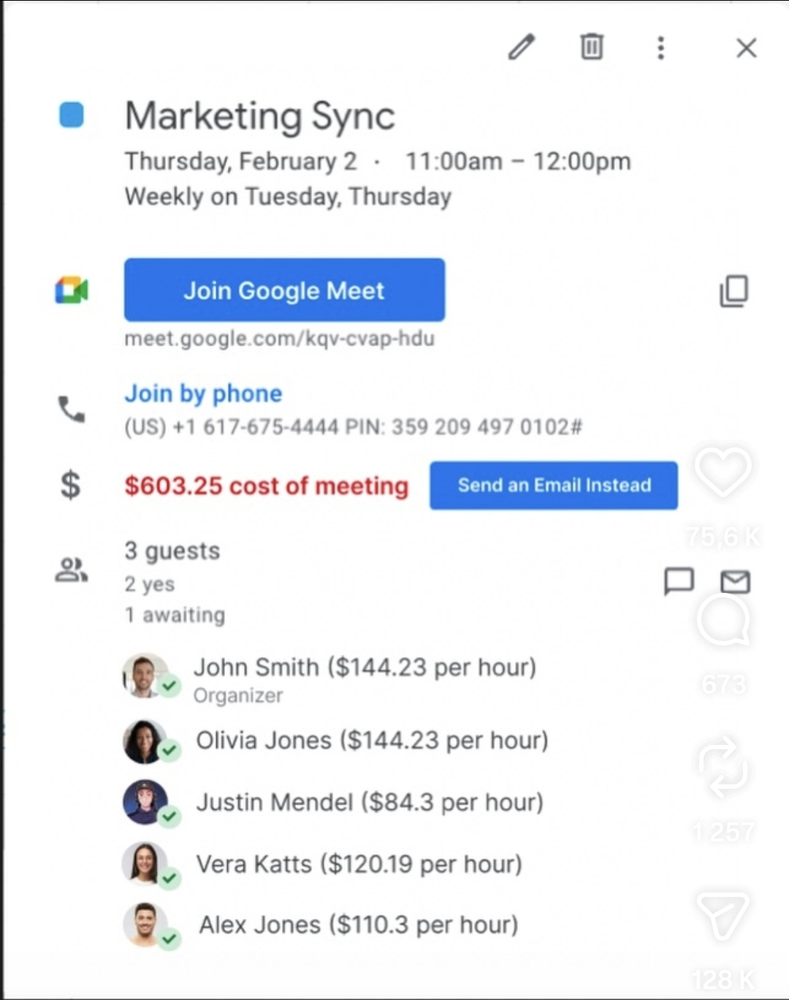

# Meeting Cost for Google Calendar

A Chrome extension (Manifest V3) that shows the **cost of a meeting** directly in
the Google Calendar event popup, based on each attendee's hourly rate — plus a
`($rate per hour)` annotation next to every guest.



The total is computed as:

```
cost = meeting_duration_in_hours × Σ(hourly rate of each attendee)
```

Rates can be entered manually or pulled automatically from
[Everhour](https://everhour.com/) via its API.

## Features

- **Inline cost banner** injected into the Google Calendar event detail popup.
- **Per‑attendee hourly rate** shown next to each guest.
- **Settings page** to manage rates per colleague (by email), currency, and a
  fallback default rate.
- **Everhour sync** — enter your API key and import the whole team's rates
  (choose *cost* or *bill* rate).
- **Quick toggle** in the toolbar popup to enable/disable the overlay.
- All data stays in your browser (`chrome.storage.local`); the only network
  call is to Everhour, and only when you click *Sync*.

## Install (developer / unpacked)

1. Clone or download this repository.
2. Open `chrome://extensions` in Chrome.
3. Enable **Developer mode** (top‑right).
4. Click **Load unpacked** and select the project folder (the one containing
   `manifest.json`).
5. Open [Google Calendar](https://calendar.google.com) and click an event with
   guests — the cost appears in the popup.

## Setup

Open the extension's **options** page (right‑click the toolbar icon →
*Options*, or click *Open settings* in the popup).

### Manual rates

Use **Add person** to add a row with an email, name, and hourly rate. Matching
is done by email first, then by name, and finally falls back to the configured
**Default rate / hour** (set it to `0` to ignore unknown attendees).

### Everhour sync

1. In Everhour, go to **My Profile → API & Integrations** and copy your API key.
2. Paste it into the **Everhour API key** field in the options page.
3. Choose which rate to use:
   - **Cost rate** — the internal cost of an employee (`cost` field).
   - **Bill rate** — the client billing rate (`rate` field).
4. Click **Sync from Everhour**, then **Save settings**.

Everhour returns monetary values in cents; the extension converts them to your
currency automatically.

## How it works

| Piece | File | Responsibility |
| ----- | ---- | -------------- |
| Content script | `src/content.js` | Detects event popups, parses duration + attendees, injects the cost. |
| Styles | `src/content.css` | Styling for the injected banner / annotations. |
| Background worker | `src/background.js` | Talks to the Everhour API (`/team/users`). |
| Options page | `src/options.*` | Settings + rates table + Everhour sync UI. |
| Toolbar popup | `src/popup.*` | Enable/disable toggle and summary. |
| Shared helpers | `src/storage.js` | Storage schema, rate resolution, money formatting. |

### A note on Google Calendar's DOM

Google Calendar's markup is obfuscated and changes periodically. Rather than
relying on brittle CSS class names, the content script finds attendees via their
`data-email` attributes and locates the popup by climbing to the nearest
ancestor whose text contains a time range (see `TIME_RANGE_RE` in
`src/content.js`). If a future Google update breaks detection, that regex and
the `data-email` selector are the first things to revisit.

## Privacy

The extension requests access only to `calendar.google.com` (to display costs)
and `api.everhour.com` (to sync rates when you ask it to). Your rates and API
key are stored locally in your browser and are never sent anywhere else.
